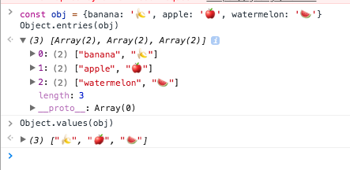
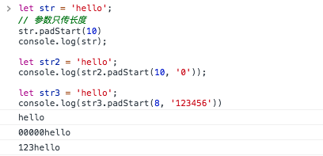
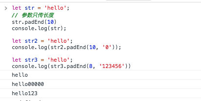
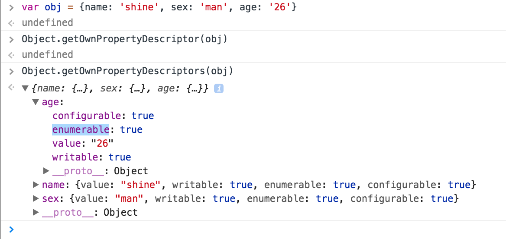
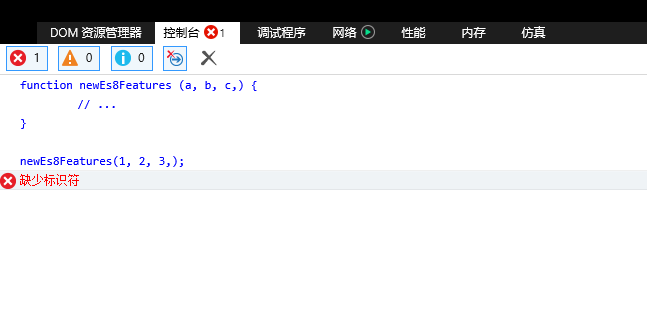
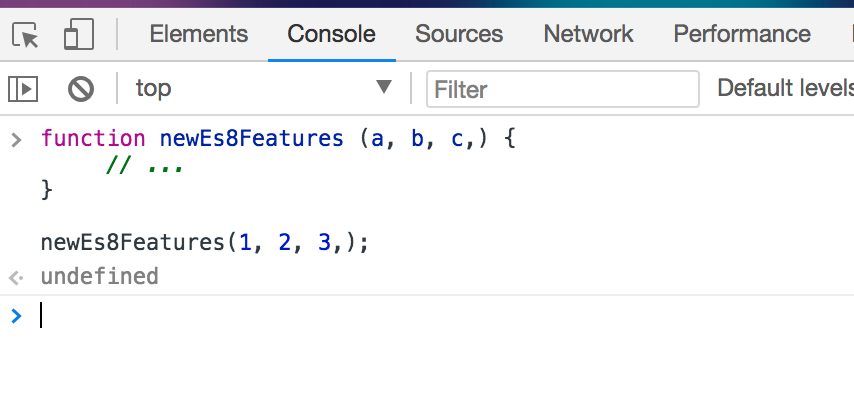

## ECMAScript 2017

###  <span id ="Async-functions">Async functions</span>（异步函数）

异步方法一直返回[Promises](https://developer.mozilla.org/en-US/docs/Web/JavaScript/Reference/Global_Objects/Promise)

使用`async`关键字定义一个异步方法

```
    async function asyncFunc() {
        return 123;
    }

    asyncFunc()
    .then(x => console.log(x));

```


```js
	async getHomeData (url: string) {
        try {
            let response = await axios.get(url); // 等待请求返回
            return response.data;
        } catch (err) { 
            throw err;
        };
    }

```
上面是一个异步请求代码片段

###  <span id = "Shared-memory-and-atomicsd">Shared memory and atomicsd</span>（共享内存和原子操作）

[Shared memory](https://www.ecma-international.org/ecma-262/8.0/#sec-memory-model-fundamentals)

[atomicsd](https://www.ecma-international.org/ecma-262/8.0/#sec-memory-model-fundamentals)

### <span id = "entries-values">Object.entries() and Object.values()</span> ()

`Object.entries()`和`Object.values()` 方法返回一个给定对象自己的所有可枚举属性的数组

`Object.entries()` 给定对象自身可枚举属性的键值对数组

`Object.values()` 给定对象自身可枚举属性值的数组

```js
const obj = {banana: '🍌', apple: '🍎', watermelon: '🍉'}
Object.entries(obj)
Object.values(obj)
``` 



### <span id = "padStart-padEnd">New string methods: padStart and padEnd</span> （新的字符串方法：`padStart` 和 `padEnd`）

`padStart()` 在字符串之前填充字符，返回一个新的字符串。

语法： `str.padStart(targetLength [, padString])`

```js
let str = 'hello';
// 参数只传长度
str.padStart(10)
console.log(str);

let str2 = 'hello';
console.log(str2.padStart(10, '0'));

let str3 = 'hello';
console.log(str3.padStart(8, '123456'))
```


`padEnd()` 在字符串之后填充字符，返回一个新的字符串。

语法： `str.padEnd(targetLength [, padString])`

```js
let str = 'hello';
// 参数只传长度
str.padEnd(10)
console.log(str);

let str2 = 'hello';
console.log(str2.padEnd(10, '0'));

let str3 = 'hello';
console.log(str3.padEnd(8, '123456'))
```


[padStart](https://developer.mozilla.org/zh-CN/docs/Web/JavaScript/Reference/Global_Objects/String/padStart)
[padEnd](https://developer.mozilla.org/zh-CN/docs/Web/JavaScript/Reference/Global_Objects/String/padEnd)

###  <span id = "Object-getOwnPropertyDescriptors">Object.getOwnPropertyDescriptors()</span> (对象的新方法`getOwnPropertyDescriptors()` (对象的属性描述符获取))

```js
let obj = {
    name: 'shine',
    sex: 'man',
    age: '26'
}

Object.getOwnPropertyDescriptors(obj)
```



```
configurable:true  // 是否可配置
enumerable:true // 是否可枚举
value:"26"  // 值
writable:true  // 是否可写
```

简单实现`Object.getOwnPropertyDescriptors`

```js
function getOwnPropertyDescriptors(obj) {
    const result = {};
    for (let key of Reflect.ownKeys(obj)) {
        result[key] = Object.getOwnPropertyDescriptor(obj, key);
    }
    return result;
}
```

[Object.getOwnPropertyDescriptors](http://2ality.com/2016/02/object-getownpropertydescriptors.html)

###  <span id = "lists-calls">Trailing commas in function parameter lists and calls</span> (参数列表和调用中的逗号)

```js
	
function newEs8Features (a, b, c,) {
	 // ...
}

newEs8Features(1, 2, 3,);

```

新特性允许我们定义方法或者调用时允许有多余的逗号而不报错



IE浏览器（IE 11）



Chrome浏览器（Chrome 65）


### 结束语

如果你喜欢请star🌟 谢谢

资源：

[ECMAScript® 2017 Language Specification (ECMA-262, 8th edition, June 2017)](http://www.ecma-international.org/ecma-262/8.0/index.html)

[MDN](https://developer.mozilla.org/en-US/docs/Web/JavaScript/Reference/Statements/async_function)


