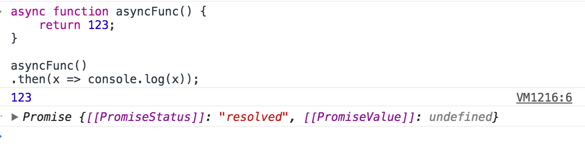

# ECMAScript 2017

Major new features:
+   [Async functions](#Async-functions)
+   [Shared memory and atomicsd](#Shared-memory-and-atomicsd)
+   [Object.entries() and Object.values()](#entries-values)
+   [New string methods: padStart and padEnd](#padStart-padEnd)
+   [Object.getOwnPropertyDescriptors()](#Object-getOwnPropertyDescriptors)
+   [Trailing commas in function parameter lists and calls](#lists-calls)


##  <span id = "Async-functions">Async functions</span>

Async functions always return [Promises](https://developer.mozilla.org/en-US/docs/Web/JavaScript/Reference/Global_Objects/Promise)

```
    async function asyncFunc() {
        return 123;
    }

    asyncFunc()
    .then(x => console.log(x));

```



##  <span id = "Shared-memory-and-atomicsd">Shared memory and atomicsd</span>


##  <span id = "entries-values">Object.entries() and Object.values()</span>

##  <span id = "padStart-padEnd">New string methods: padStart and padEnd</span>


##  <span id = "Object-getOwnPropertyDescriptors">Object.getOwnPropertyDescriptors()</span>

##  <span id = "lists-calls">Trailing commas in function parameter lists and calls</span>
